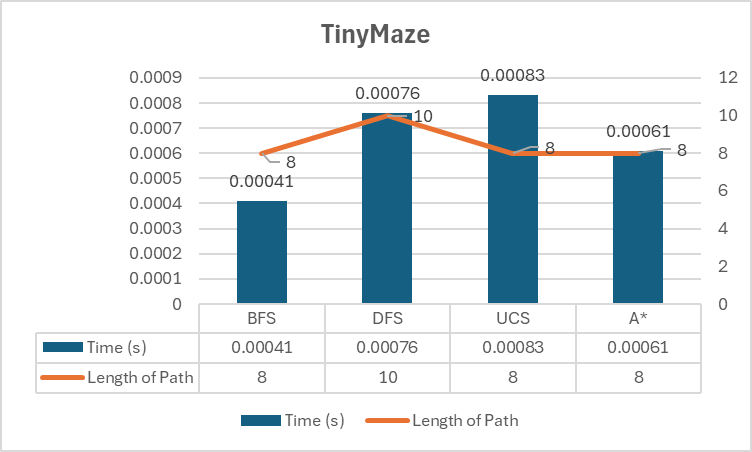
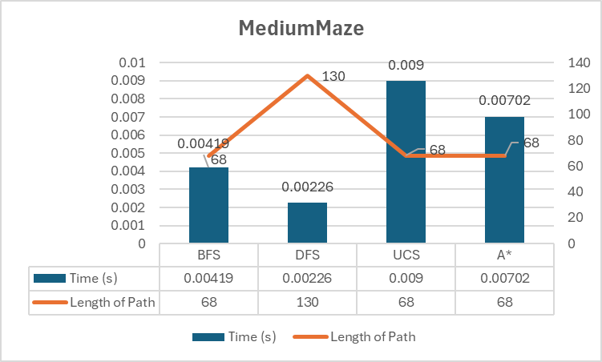
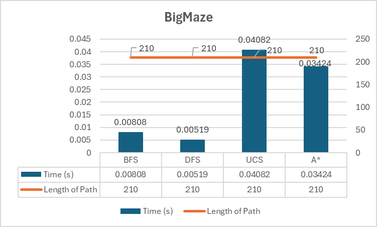

# PACMAN

## Overview

Pac3man is a Python 3 adaptation of the popular Berkeley Pacman assignments. This project provides an educational framework for understanding and implementing key search algorithms in artificial intelligence, such as DFS, BFS, UCS, and A*. These assignments are designed to help students learn problem-solving strategies and explore AI concepts interactively.

In addition to the Pacman assignments, the repository also includes:

1.Markov Babbler: A simple text generator using Markov chains.
<br>
2.Naive Bayesian Spam Classifier: A spam detection tool based on naive Bayesian classification.

## Maze Search Algorithm Performance

Below is a performance comparison of different search algorithms (BFS, DFS, UCS, A*) across three maze configurations (tinyMaze, mediumMaze, bigMaze). The table includes the hypothetical runtime and path length data for each algorithm, which should be replaced with actual values after running the commands.

### TinyMaze

| Algorithm | Time (s) | Length of Path |
|-----------|----------|----------------|
| BFS       | 0.00041     | 8              |
| DFS       | 0.00076     | 10              |
| UCS       | 0.00083     | 8              |
| A*        | 0.00061     | 8              |



### MediumMaze

| Algorithm | Time (s) | Length of Path |
|-----------|----------|----------------|
| BFS       | 0.00419     | 68             |
| DFS       | 0.00226     | 130            |
| UCS       | 0.00900     | 68             |
| A*        | 0.00702     | 68             |



### BigMaze

| Algorithm | Time (s) | Length of Path |
|-----------|----------|----------------|
| BFS       | 0.00808     | 210            |
| DFS       | 0.00519     | 210            |
| UCS       | 0.04082     | 210            |
| A*        | 0.03424     | 210            |



Run the following commands to populate the tables with actual results:

#### tinyMaze
<ul>
<li>python pacman.py -l tinyMaze -p SearchAgent -a fn=bfs</li>
<li>python pacman.py -l tinyMaze -p SearchAgent -a fn=dfs</li>
<li>python pacman.py -l tinyMaze -p SearchAgent -a fn=ucs</li>
<li>python pacman.py -l tinyMaze -p SearchAgent -a fn=astar,heuristic=manhattanHeuristic</li>
</ul>
#### mediumMaze
<ul>
<li>python pacman.py -l mediumMaze -p SearchAgent -a fn=bfs</li>
<li>python pacman.py -l mediumMaze -p SearchAgent -a fn=dfs</li>
<li>python pacman.py -l mediumMaze -p SearchAgent -a fn=ucs</li>
<li>python pacman.py -l mediumMaze -p SearchAgent -a fn=astar,heuristic=manhattanHeuristic</li>
</ul>

#### bigMaze
<ul>
<li>python pacman.py -l bigMaze -p SearchAgent -a fn=bfs</li>
<li>python pacman.py -l bigMaze -p SearchAgent -a fn=dfs</li>
<li>python pacman.py -l bigMaze -p SearchAgent -a fn=ucs</li>
<li>python pacman.py -l bigMaze -p SearchAgent -a fn=astar,heuristic=manhattanHeuristic</li>
</ul>
## Search Algorithms Implementation

### tinyMazeSearch Function

Returns a hardcoded solution for tinyMaze. Use this only for tinyMaze.

```python
def tinyMazeSearch(problem):
    from game import Directions
    s = Directions.SOUTH
    w = Directions.WEST
    return [s, s, w, s, w, w, s, w]
```

### depthFirstSearch Function

Searches the deepest nodes in the search tree first. Implements a graph search algorithm using a stack for the frontier.

```python
def depthFirstSearch(problem):
    startState = problem.getStartState()
    if problem.isGoalState(startState):
        return []

    frontier = util.Stack()
    frontier.push((startState, []))
    explored = set()

    while not frontier.isEmpty():
        state, actions = frontier.pop()

        if problem.isGoalState(state):
            return actions

        if state not in explored:
            explored.add(state)
            for successor, action, stepCost in problem.getSuccessors(state):
                if successor not in explored:
                    newActions = actions + [action]
                    frontier.push((successor, newActions))

    return []
```

### breadthFirstSearch Function

Searches the shallowest nodes in the search tree first. Uses a queue for the frontier.

```python
def breadthFirstSearch(problem):
    currPath = []
    currState = problem.getStartState()
    if problem.isGoalState(currState):
        return currPath

    frontier = Queue()
    frontier.push((currState, currPath))
    explored = set()
    while not frontier.isEmpty():
        currState, currPath = frontier.pop()
        if problem.isGoalState(currState):
            return currPath
        explored.add(currState)
        frontierStates = [t[0] for t in frontier.list]
        for s in problem.getSuccessors(currState):
            if s[0] not in explored and s[0] not in frontierStates:
                frontier.push((s[0], currPath + [s[1]]))

    return []
```

### uniformCostSearch Function

Searches the node with the least total cost first. Uses a priority queue to manage the frontier.

```python
def uniformCostSearch(problem):
    from util import Queue, PriorityQueue
    fringe = PriorityQueue()
    fringe.push(problem.getStartState(), 0)
    visited = []
    tempPath = []
    path = []
    pathToCurrent = PriorityQueue()
    currState = fringe.pop()
    while not problem.isGoalState(currState):
        if currState not in visited:
            visited.append(currState)
            successors = problem.getSuccessors(currState)
            for child, direction, cost in successors:
                tempPath = path + [direction]
                costToGo = problem.getCostOfActions(tempPath)
                if child not in visited:
                    fringe.push(child, costToGo)
                    pathToCurrent.push(tempPath, costToGo)
        currState = fringe.pop()
        path = pathToCurrent.pop()
    return path
```

### nullHeuristic Function

A trivial heuristic function that always returns 0. Used as a baseline for A*.

```python
def nullHeuristic(state, problem=None):
    return 0
```

### A* Search Function

Searches the node with the lowest combined cost and heuristic. Uses a priority queue.

```python
def aStarSearch(problem, heuristic=nullHeuristic):
    from util import Queue, PriorityQueue
    fringe = PriorityQueue()
    fringe.push(problem.getStartState(), 0)
    currState = fringe.pop()
    visited = []
    tempPath = []
    path = []
    pathToCurrent = PriorityQueue()
    while not problem.isGoalState(currState):
        if currState not in visited:
            visited.append(currState)
            successors = problem.getSuccessors(currState)
            for child, direction, cost in successors:
                tempPath = path + [direction]
                costToGo = problem.getCostOfActions(tempPath) + heuristic(child, problem)
                if child not in visited:
                    fringe.push(child, costToGo)
                    pathToCurrent.push(tempPath, costToGo)
        currState = fringe.pop()
        path = pathToCurrent.pop()
    return path
```
